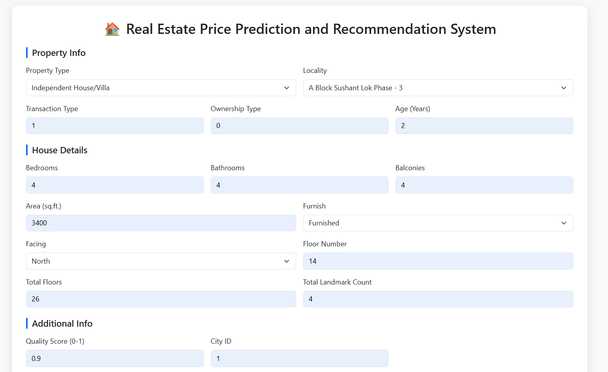
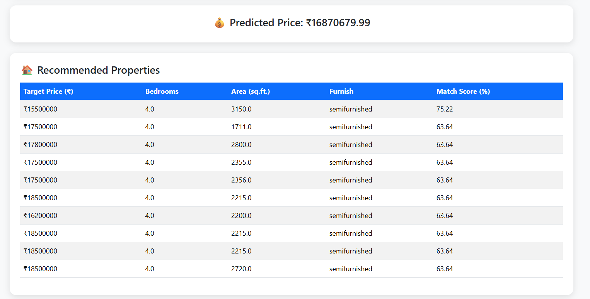

# Location-Aware-Real-Estate-Price-Prediction-Recommendation-Engine
A Full-stack Python application that combines Machine Learning, Web development, and SQL integration to create a smart real estate platform. The system predicts property prices based on user-provided details and recommends similar listings, helping users make more informed decisions.

